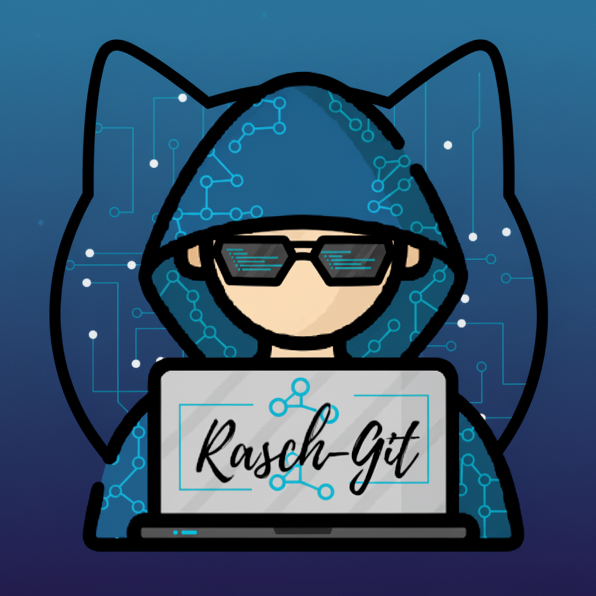

# Rasch-Git

**A powerful cross-platform Git client.**
_Everything you need from a Git client — and more._

 

 
**Key Features:** Fully Async GUI · Smart Diff Views · Built-in Terminal · Auto Fetch · Bulk Branch & Repo Management · Conflict Resolution · Commit Graph Virtualization · Tab Grouping · Commit Search · Customizable Commit Templates

---

© 2025 Raschild. All rights reserved.
Redistribution of these binaries is not permitted without explicit authorization.

